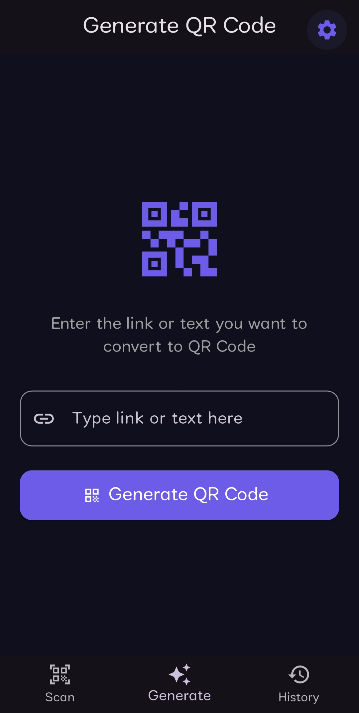
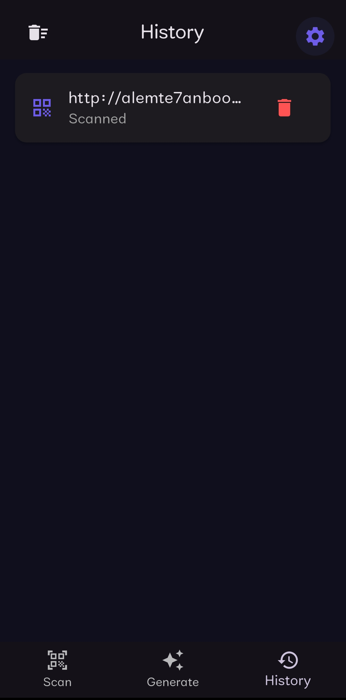
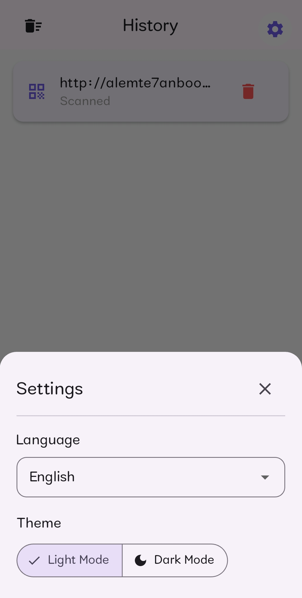
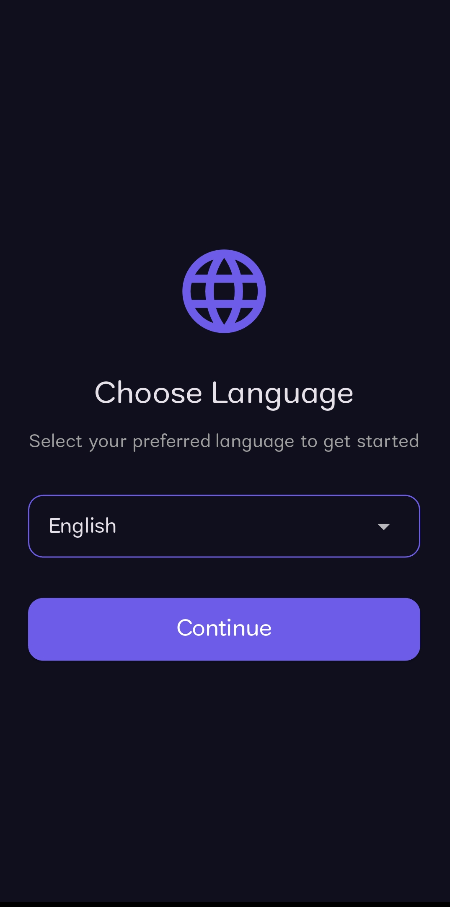
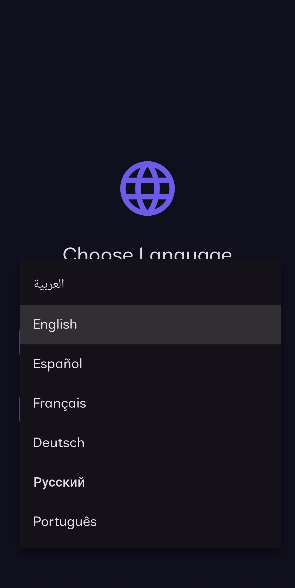

# ⚡ QRAi - Smart QR Code Scanner & Generator

<p align="center">
  
</p>

**QRAi** is a high-performance, modern cross-platform mobile application built with **Flutter**. It offers fast and accurate QR code scanning, custom QR code generation, offline history persistence, and integrated **Google Gemini AI** for intelligent content analysis, all wrapped in a multi-language responsive UI.

---

## ✨ Key Features

* 🔍 **Instant QR Scanning:** Real-time QR code scanning via camera or from gallery images.
* ✍️ **Custom QR Generator:** Easily create QR codes for links, plain text, and contact information.
* 🤖 **AI-Powered Insights:** Integrated  with **Google Gemini AI** to summarize, analyze, and process scanned content automatically.
* 📜 **Offline Local Storage:** Fast, lightweight history management using **Hive** database (works completely offline).
* 🌍 **Full 7-Language Support:** Comprehensive localization with full support for both RTL and LTR layouts:
   * English
   * Arabic (العربية)
   * Spanish (Español)
   * French (Français)
   * German (Deutsch)
   * Russian (Русский)
   * Portuguese (Português)
* 🌙 **Dark & Light Themes:** Modern UI with customizable Dark Mode, Light Mode, and system-default adaptation.

---

## 🛠️ Tech Stack & Packages

* **Framework:** [Flutter](https://flutter.dev/) (Dart)
* **Database:** [Hive](https://pub.dev/packages/hive) & [Hive Flutter](https://pub.dev/packages/hive_flutter)
* **AI Integration:** [Google Generative AI 
* **Scanning & Generating:** [mobile_scanner](https://pub.dev/packages/mobile_scanner) & [qr_flutter](https://pub.dev/packages/qr_flutter)
* **Preferences:** [SharedPreferences](https://pub.dev/packages/shared_preferences)
* **Localization:** `flutter_localizations` with JSON translation assets

---

## 📥 Download & Test

You can download the ready-to-use APK and test the app directly on your Android device:
* **[📥 Download QR AI v1.0 (APK)](https://www.mediafire.com/file/h43h936fol8gahh/QR_AI.apk/file)**

---
---

## 📱 Screenshots

<p align="center">
  
  
  
  
  
</p>
-
---
##📞 Contact & Support
Developer: Yahya 💪

WhatsApp: Message me on WhatsApp (+20 155 342 7179)


---
## 🚀 Getting Started

1. Clone the repository:
   ```bash
git clone [https://github.com/yahyaemad887-alt/Qr-Ai.git](https://github.com/yahyaemad887-alt/Qr-Ai.git)
cd Qr-Ai
